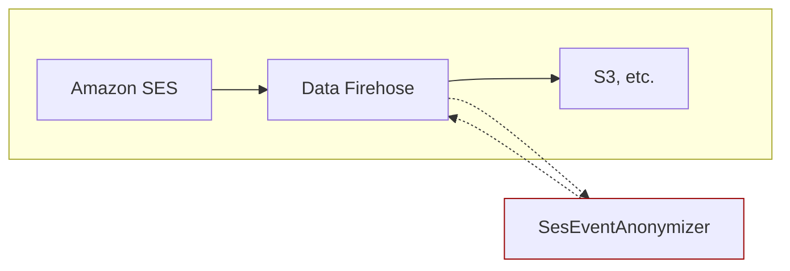

# SES Event Anonymizer



This project provides an AWS Lambda function that anonymizes personally identifiable information (PII) within Amazon SES (Simple Email Service) events. It is designed to be used as a transformation function in Amazon Kinesis Data Firehose.

## Features

- **PII Masking**: Masks recipient email addresses and subject lines in SES event records.
- **Multiple Event Types**: Supports various SES event types, including:
  - Delivery
  - Mail
  - Bounce
  - Complaint
  - Delivery Delay
  - ref: [Examples of event data that Amazon SES publishes to Amazon SNS](https://docs.aws.amazon.com/ses/latest/dg/event-publishing-retrieving-sns-examples.html)

## Architecture

The architecture is straightforward:

1.  **Amazon SES** sends email sending events to **Amazon Kinesis Data Firehose**.
2.  **Kinesis Data Firehose** is configured to use the provided **AWS Lambda function** for data transformation.
3.  The Lambda function processes each event record, masking recipient email addresses and subject lines.
4.  The anonymized data is then delivered by Kinesis Data Firehose to its destination (e.g., Amazon S3, Amazon Redshift, etc.).

## Deployment

This project can be deployed using the AWS SAM CLI.

1.  **Prerequisites**:

    - AWS CLI
    - AWS SAM CLI
    - Go

2.  **Configuration**

    Before deploying, you may need to edit the `samconfig.toml` file to match your AWS environment settings, such as the S3 bucket for deployment artifacts and the region.

3.  **Build the application**:

    ```bash
    sam build
    ```

4.  **Deploy the application**:

    ```bash
    sam deploy
    ```

    This will create the Lambda function and necessary IAM roles. After deployment, you can configure a Kinesis Data Firehose delivery stream to use this Lambda function for transformation.
